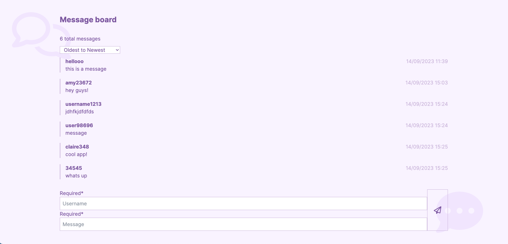

# Mini Message Board

## [Live Demo](http://shopping-cart-erinsophie.netlify.app)

# Frontend

- React
- Tailwind

# Backend

- Node
- Express
- MongoDB

# Goal

The main goal of this project was to create my first Express server, connect it to my MongoDB database and learn how to connect it with a frontend framework such as React.

## Node, Express, MongoDB

Before starting this project I had only created a very small server with Express and had gone through a MongoDB course but I was feeling confused about how the server and database come together to make a full stack application, especially when React is involved. The only way I was gonna find out was by trying to do it! So this is that app. I think a message board is a very simple way to get started since it just requires 1 GET request and 1 POST request. Also, using the mongoDB Atlas makes it simple to monitor the database.

I originally had all the server files in one server.js file until I gradually extracted each function out into its own directory within the server directory. I was unclear on what models, controllers and routes were actually for until I began to create the file structure myself and leart how each part comes together and why it's necessary for organisation.

After using fetch to make GET requests in previous projects, it was very interesting to be responsible for syncing both the front and back end. Through formatting the response to send to the client I feel like it's given me a much better idea of how GET requests actually work and now POST requests too. This is very helpful knowledge for future projects!

Server directory structure:

- config: Setting up the connection to the database
- model: Defining the message schema and model
- controllers: The functions to find the documents or post the new message to the database
- routes: Defines which function to be called from controllers whenever a GET or POST request is received
- server.js: Defines middleware that sets up CORS, allowing the server to respond to requests from the given origin, prefixes all of the message routes with /api and uses express.json to parse json into js before it reaches the controllers
